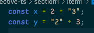

# 타입스크립트 알아보기

- 타입스크립트는 인터프리터나 컴파일 언어로써 취급하면 안됨.
- ts / js 관계는 필연적

## 아이템 1. 타입스크립트와 자바스크립트의 관계 이해하기

- 타입스크립트는 자바스크립트의 상위집합(superset)
- 모든 js 는 유효한 ts 다 (참), 모든 ts 는 유효한 js 다 (거짓)
- 타입스크립트 문법이나 타입 체커에 위배되더라도 자바스크립트로 변환이 가능함
- _.js 를 _.ts 로 변환하더라도 달라지는것은 없음
- 이러한 특성은 js -> ts 마이그레이션에 이점이 있음
- 타입스크립트에는 자바스크립트에 없는 추가적인 문법이 있기에, 모든 타입스크립트가 자바스크립트 일수 없음.

- 타입스크립트는 초깃값 으로부터 타입 추론을 함.
- '정적 타입 시스템' 의 의미 -> "타입 시스템의 목표중 하나인 런타임에 발생시킬 오류를 미리 찾는것."
- 오류는 아니더라도 의도와 다르게 동작하는 코드를 찾기도함.
- 타입 구문을 통해 원래 코드의 의도를 분명하게 하면 어디에서 오류가 발생했는지 정확하게 알수 있고, 제시된 해결책이 올바른지 알수 있다. 의도가 명확해 져서 타입스크립트가 잠재적 문제점을 찾을 수 있게 도와준다.

  

- 일부 자바스크립트만이 타입체크를 통과하고, 보통 작성되는 코드가 타입 체커를 통과한 타입스크립트 프로그램 이다.

- 타입스크립트 타입 시스템은 자바스크립트의 런타임 동작을 모델링 한다.
- 아래 예제는 런타임 에러가 발생하지 않으며, 타입 체커도 정상으로 인식함

  

- 정상 동작 코드에 오류를 표시하기도 함.

  

- 타입 시스템은 단순히 런타임 동작을 모델링 하는것 뿐만 아니라 의도치 않은 이상한 코드가 오류로 이어질수 있다는 점 까지 고려한다.
- 자바스크립트 특성을 이용한, 이상한 코드들을 사용하는것을 당연하게 여긴다면 타입스크립트는 차라리 쓰지 않는것이 낫다.

- 타입 체커를 통과하더라도 런타임에 오류가 발생할수도 있음.
  
  

- 위에서 이야기한 오류들이 발생하는 근본 원인은 타입스크립트가 이해하는 값의 타입과 실제 값에 차이가 있기 때문
- 타입 시스템이 정적 타입의 정확성을 보장해 줄것 같지만 그렇지 않음. 애초에 타입 시스템은 그런 목적으로 만들어지지 않음.

### Summary

> - 타입스크립트는 자바스크립트의 상위 집합
> - 모든 자바스크립트 프로그램은 이미 타입스크립트 프로그램
> - 타입스크립트는 별도의 문법이 있기에 일반적으로 유효한 자바스크립트 프로그램 아님

> - 타입스크립트는 자바스크립트 런타임 동작을 모델링 하는 타입 시스템
> - 때문에 런타임 오류를 발생시키는 코드를 찾아내려고 함
> - 하지만 모든 오류를 찾아낼것이라 기대하는것은 잘못됨

> - 알려지지 않은 객체 프로퍼티 접근처럼 자바스크립트에서 허용되지만 타입스크립트에서 문제가 되는 경우도 있음
> - 이러한 문법의 엄격함은 온전히 취향 차이이며 우열을 가릴수 없음

### Insight

- 평소에 작업하며 몸으로만 체감했던 오류 지점을 만나볼수 있었음
- 왜 그런지에 대해 좀더 깊이 알아볼수 있을것 같음
